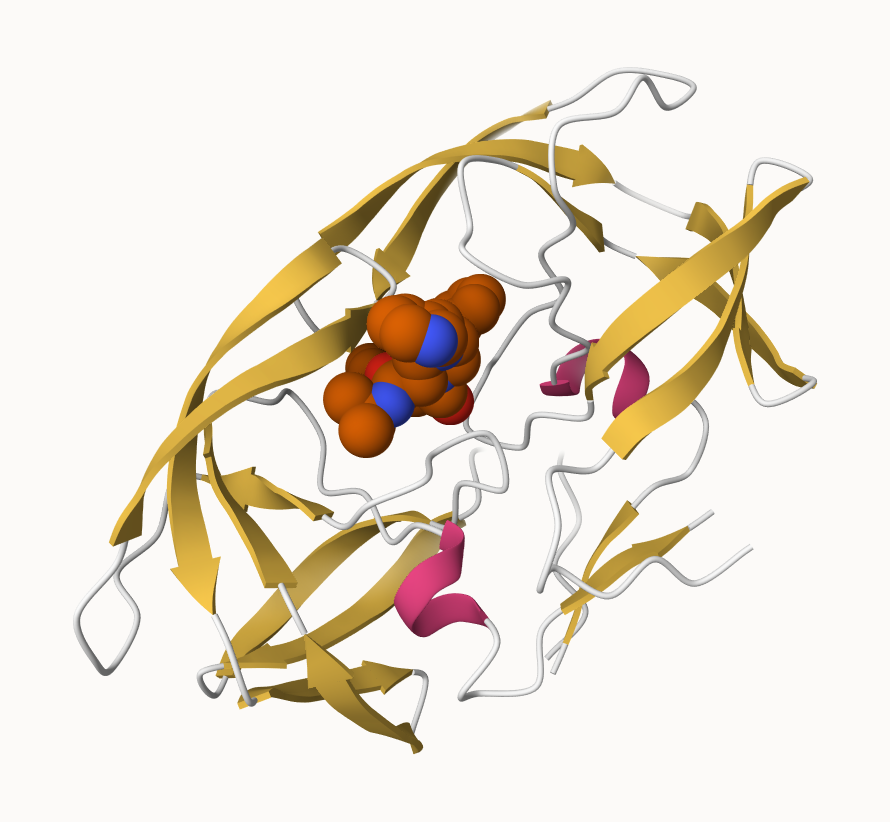

# Lab 10
Lindsey China (A17023629)

- [Introduction to the RCSB Protein Data Bank
  (PDB)](#introduction-to-the-rcsb-protein-data-bank-pdb)
  - [PDB Statistics](#pdb-statistics)
  - [The PDB Format](#the-pdb-format)
- [Visualizing the HIV-1 protease
  structure](#visualizing-the-hiv-1-protease-structure)
  - [The important role of water](#the-important-role-of-water)
- [Introduction to Bio3D in R](#introduction-to-bio3d-in-r)
  - [Reading the PDB file data into
    R](#reading-the-pdb-file-data-into-r)
  - [Predicting functional motions of a single
    structure](#predicting-functional-motions-of-a-single-structure)
- [Comparitive structure analysis of Adenylate
  Kinase](#comparitive-structure-analysis-of-adenylate-kinase)
  - [Overview](#overview)
  - [Setup](#setup)
  - [Search and retrieve ADK
    structures](#search-and-retrieve-adk-structures)
- [Align and superpose structures](#align-and-superpose-structures)
  - [Annotate collected PDB
    structures](#annotate-collected-pdb-structures)
  - [PCA](#pca)

# Introduction to the RCSB Protein Data Bank (PDB)

The PDB is the major repository of information about the 3D structures
of large biological molecules, including proteins and nucleic acids.
Understanding the shape of these molecules helps to understand how they
work and deduce the role of structure in human health. The structures in
PDB range from bits of DNA/RNA to complex machines of many chains of
protein.

We will use the main US based PDB website.

## PDB Statistics

> Q1. What percentage of structures in the PDB are solved by X-Ray and
> electron microscopy?

``` r
184362/219140
```

    [1] 0.8412978

84.13% of entries are solved with X-Ray

``` r
20191/219140
```

    [1] 0.09213745

9.21% of entries are solved with electron microscopy.

> Q2. What proportion of structures in the PDB are protein?

``` r
189750/219140
```

    [1] 0.8658848

86.59% of structures are protein only.

> Q3. Type HIV in the PDB website search box on the home page and
> determine how many HIV-1 protease structures are in the current PDB:

There are 868 structures in the PDB for HIV-1 protease.

## The PDB Format

Download the “PDB File” fo the HIV-1 protease structure with the PDB
identifier 1HSG.

To view the contents in the Terminal, use `less ~/Downloads/1hsg.pdb`

The file contains a list of all the atoms in the molecule with their
positions defined by X, Y, and Z coordinates. Additional data such as
secondary structure elements are commonly also included.

# Visualizing the HIV-1 protease structure

HIV-1 protease is vital for HIV replication, cleaving newly formed
polypeptide chains to form functional proteins. Drugs that target this
protein could be vital for suppressing viral replication.

In this section, we’ll use the X-ray crystal structure with a bound drug
(indinavir) and the Mol\* molecular viewer to visually inspect the
protein, binding site, and drug molecule. Then we will perform
bioinformatics analysis of single and multiple crystallographic
structures.

Image of HIV-Pr



HIV-Pr with Asp25 featured

.png)

## The important role of water

> Q4. Water molecules normally have 3 atoms, why do we see just one atom
> per water molecule in this structure?

A water molecule has 2 hydrogens and 1 oxygen, in this structure,
hydrogens are not included since it would make the structure harder to
see. Instead they include just the oxygen atom for each water molecule.

> Q5. There is a critical “conserved” water molecule in the binding
> site, can you identify the molecule? What residue number does this
> molecule have?

The conserved water molecule is at number 308.

> Q6. Generate and save a figure clearly showing the two distinct chains
> of HIV-protease along with the ligan. You might also consider showing
> the catalytic residues ASP 25 in each chain and the critical water.

.png)

# Introduction to Bio3D in R

Bio3D is an R package for structural bioinformatics, including features
to read, write, and analyze biomolecular structure, sequence, and
dynamic trajectory data.

``` r
library(bio3d)
```

## Reading the PDB file data into R

``` r
pdb <- read.pdb("1hsg")
```

      Note: Accessing on-line PDB file

``` r
pdb
```


     Call:  read.pdb(file = "1hsg")

       Total Models#: 1
         Total Atoms#: 1686,  XYZs#: 5058  Chains#: 2  (values: A B)

         Protein Atoms#: 1514  (residues/Calpha atoms#: 198)
         Nucleic acid Atoms#: 0  (residues/phosphate atoms#: 0)

         Non-protein/nucleic Atoms#: 172  (residues: 128)
         Non-protein/nucleic resid values: [ HOH (127), MK1 (1) ]

       Protein sequence:
          PQITLWQRPLVTIKIGGQLKEALLDTGADDTVLEEMSLPGRWKPKMIGGIGGFIKVRQYD
          QILIEICGHKAIGTVLVGPTPVNIIGRNLLTQIGCTLNFPQITLWQRPLVTIKIGGQLKE
          ALLDTGADDTVLEEMSLPGRWKPKMIGGIGGFIKVRQYDQILIEICGHKAIGTVLVGPTP
          VNIIGRNLLTQIGCTLNF

    + attr: atom, xyz, seqres, helix, sheet,
            calpha, remark, call

> Q7. How many amino acid residues are in this pdb object?

There are 198 amino acid residues

> Q8. Name one of the two non-protein residues:

HOH

> Q9. How many protein chains are in this structure?

There are 2 protein chains

Note that the attributes of the object are listed at the end, to find
the attributes of any such object use:

``` r
attributes(pdb)
```

    $names
    [1] "atom"   "xyz"    "seqres" "helix"  "sheet"  "calpha" "remark" "call"  

    $class
    [1] "pdb" "sse"

To access these individually use \$ like R list objects. For example, to
find the atom attribute:

``` r
head(pdb$atom)
```

      type eleno elety  alt resid chain resno insert      x      y     z o     b
    1 ATOM     1     N <NA>   PRO     A     1   <NA> 29.361 39.686 5.862 1 38.10
    2 ATOM     2    CA <NA>   PRO     A     1   <NA> 30.307 38.663 5.319 1 40.62
    3 ATOM     3     C <NA>   PRO     A     1   <NA> 29.760 38.071 4.022 1 42.64
    4 ATOM     4     O <NA>   PRO     A     1   <NA> 28.600 38.302 3.676 1 43.40
    5 ATOM     5    CB <NA>   PRO     A     1   <NA> 30.508 37.541 6.342 1 37.87
    6 ATOM     6    CG <NA>   PRO     A     1   <NA> 29.296 37.591 7.162 1 38.40
      segid elesy charge
    1  <NA>     N   <NA>
    2  <NA>     C   <NA>
    3  <NA>     C   <NA>
    4  <NA>     O   <NA>
    5  <NA>     C   <NA>
    6  <NA>     C   <NA>

## Predicting functional motions of a single structure

Let’s read a new PDB structure, Adenylate Kinase, and perform Normal
mode analysis (NMA).

``` r
adk <- read.pdb("6s36")
```

      Note: Accessing on-line PDB file
       PDB has ALT records, taking A only, rm.alt=TRUE

``` r
adk
```


     Call:  read.pdb(file = "6s36")

       Total Models#: 1
         Total Atoms#: 1898,  XYZs#: 5694  Chains#: 1  (values: A)

         Protein Atoms#: 1654  (residues/Calpha atoms#: 214)
         Nucleic acid Atoms#: 0  (residues/phosphate atoms#: 0)

         Non-protein/nucleic Atoms#: 244  (residues: 244)
         Non-protein/nucleic resid values: [ CL (3), HOH (238), MG (2), NA (1) ]

       Protein sequence:
          MRIILLGAPGAGKGTQAQFIMEKYGIPQISTGDMLRAAVKSGSELGKQAKDIMDAGKLVT
          DELVIALVKERIAQEDCRNGFLLDGFPRTIPQADAMKEAGINVDYVLEFDVPDELIVDKI
          VGRRVHAPSGRVYHVKFNPPKVEGKDDVTGEELTTRKDDQEETVRKRLVEYHQMTAPLIG
          YYSKEAEAGNTKYAKVDGTKPVAEVRADLEKILG

    + attr: atom, xyz, seqres, helix, sheet,
            calpha, remark, call

NMA is a stuctural bioinformatic method to predict protein flexibility
and potential functional motions.

``` r
# Perform flexibility prediction

m <- nma(adk)
```

     Building Hessian...        Done in 0.016 seconds.
     Diagonalizing Hessian...   Done in 0.275 seconds.

``` r
plot(m)
```


To view a “movie” of these motions we can generate a molecular
“trajectory” with the `mktrj()` function.

``` r
mktrj(m,file="adk_m7.pdb")
```

# Comparitive structure analysis of Adenylate Kinase

In this section we’ll perform PCA on the complete collection of
Adenylate Kinase structures in PDB. This is a ubiquitous enzyme that
functions to maintain equilibrium of cytoplasmic nucleotides. It
catalyzes the transfer of a phosphoryl from ATP to AMP, which requires a
rate limiting conformational transition.

The bio3d `pca()` function provides a convenient interface for PCA of
structure data. It can be used to capture major variations in a set of
structures, making interpretation of conformational states more clear.

## Overview

Search the entire PDB for structures related to 1AKE, superpose
identified structures, perform PCA, and calculate normal modes of each
individual structure to probe for potential differences in structural
flexibility.

## Setup

Have bio3d, devtools, biocmanager, msa, and bitbucket downloaded.

> Q10. Which of the packages above is found only on BioConductor and not
> CRAN?

msa

> Q11. Which of the above packages is not found on BioConduction or
> CRAN?

bio3d-view

> Q12. True or false: Functions from the devtools package can be used to
> install packages from GitHub and BitBucket.

True

## Search and retrieve ADK structures

Perform a blast search of the PDB database to identify related
structures to ADK. Use `get.seq()` to fetch ADK and `blast.pdb()` to
search.

``` r
library(bio3d)
aa <- get.seq("1ake_A")
```

    Warning in get.seq("1ake_A"): Removing existing file: seqs.fasta

    Fetching... Please wait. Done.

``` r
aa
```

                 1        .         .         .         .         .         60 
    pdb|1AKE|A   MRIILLGAPGAGKGTQAQFIMEKYGIPQISTGDMLRAAVKSGSELGKQAKDIMDAGKLVT
                 1        .         .         .         .         .         60 

                61        .         .         .         .         .         120 
    pdb|1AKE|A   DELVIALVKERIAQEDCRNGFLLDGFPRTIPQADAMKEAGINVDYVLEFDVPDELIVDRI
                61        .         .         .         .         .         120 

               121        .         .         .         .         .         180 
    pdb|1AKE|A   VGRRVHAPSGRVYHVKFNPPKVEGKDDVTGEELTTRKDDQEETVRKRLVEYHQMTAPLIG
               121        .         .         .         .         .         180 

               181        .         .         .   214 
    pdb|1AKE|A   YYSKEAEAGNTKYAKVDGTKPVAEVRADLEKILG
               181        .         .         .   214 

    Call:
      read.fasta(file = outfile)

    Class:
      fasta

    Alignment dimensions:
      1 sequence rows; 214 position columns (214 non-gap, 0 gap) 

    + attr: id, ali, call

> Q13. How many amino acids are in this sequence?

There are 214 amino acids

Now use this as a query to BLAST search PDB:

``` r
#b <- blast.pdb(aa)
# Running the blast causes the pdf rendering to get stuck at this chunk for 5+ minutes
```

`plot.blast()` can be used to visualize and filter BLAST results by
setting a seed position to the point of largest drop-off in normalized
scores. Here we can specify only the relevant E. coli structures:

``` r
# Plot a summary of search results
#hits <- plot(b)
```

**I got the graph of the blast results to work in R studio, but it
caused the PDF rendering to get stuck for 5+ min on these chunks so I’ve
turned it into comments here.**

``` r
# List out some "top hits":

hits <- NULL
hits$pdb.id <- c('1AKE_A','6S36_A','6RZE_A','3HPR_A','1E4V_A','5EJE_A','1E4Y_A','3X2S_A','6HAP_A','6HAM_A','4K46_A','3GMT_A','4PZL_A')

head(hits$pdb.id)
```

    [1] "1AKE_A" "6S36_A" "6RZE_A" "3HPR_A" "1E4V_A" "5EJE_A"

Use `get.pdb()` and `pdbslit()` to fetch and parse identified
structures:

``` r
# Download related PDB files:

files <- get.pdb(hits$pdb.id,path="pdbs",split=TRUE,gzip=TRUE)
```

    Warning in get.pdb(hits$pdb.id, path = "pdbs", split = TRUE, gzip = TRUE):
    pdbs/1AKE.pdb.gz exists. Skipping download

    Warning in get.pdb(hits$pdb.id, path = "pdbs", split = TRUE, gzip = TRUE):
    pdbs/6S36.pdb.gz exists. Skipping download

    Warning in get.pdb(hits$pdb.id, path = "pdbs", split = TRUE, gzip = TRUE):
    pdbs/6RZE.pdb.gz exists. Skipping download

    Warning in get.pdb(hits$pdb.id, path = "pdbs", split = TRUE, gzip = TRUE):
    pdbs/3HPR.pdb.gz exists. Skipping download

    Warning in get.pdb(hits$pdb.id, path = "pdbs", split = TRUE, gzip = TRUE):
    pdbs/1E4V.pdb.gz exists. Skipping download

    Warning in get.pdb(hits$pdb.id, path = "pdbs", split = TRUE, gzip = TRUE):
    pdbs/5EJE.pdb.gz exists. Skipping download

    Warning in get.pdb(hits$pdb.id, path = "pdbs", split = TRUE, gzip = TRUE):
    pdbs/1E4Y.pdb.gz exists. Skipping download

    Warning in get.pdb(hits$pdb.id, path = "pdbs", split = TRUE, gzip = TRUE):
    pdbs/3X2S.pdb.gz exists. Skipping download

    Warning in get.pdb(hits$pdb.id, path = "pdbs", split = TRUE, gzip = TRUE):
    pdbs/6HAP.pdb.gz exists. Skipping download

    Warning in get.pdb(hits$pdb.id, path = "pdbs", split = TRUE, gzip = TRUE):
    pdbs/6HAM.pdb.gz exists. Skipping download

    Warning in get.pdb(hits$pdb.id, path = "pdbs", split = TRUE, gzip = TRUE):
    pdbs/4K46.pdb.gz exists. Skipping download

    Warning in get.pdb(hits$pdb.id, path = "pdbs", split = TRUE, gzip = TRUE):
    pdbs/3GMT.pdb.gz exists. Skipping download

    Warning in get.pdb(hits$pdb.id, path = "pdbs", split = TRUE, gzip = TRUE):
    pdbs/4PZL.pdb.gz exists. Skipping download


      |                                                                            
      |                                                                      |   0%
      |                                                                            
      |=====                                                                 |   8%
      |                                                                            
      |===========                                                           |  15%
      |                                                                            
      |================                                                      |  23%
      |                                                                            
      |======================                                                |  31%
      |                                                                            
      |===========================                                           |  38%
      |                                                                            
      |================================                                      |  46%
      |                                                                            
      |======================================                                |  54%
      |                                                                            
      |===========================================                           |  62%
      |                                                                            
      |================================================                      |  69%
      |                                                                            
      |======================================================                |  77%
      |                                                                            
      |===========================================================           |  85%
      |                                                                            
      |=================================================================     |  92%
      |                                                                            
      |======================================================================| 100%

# Align and superpose structures

Next, use `pdbaln()` to align and optionally fit the identified PDB
structures.

``` r
#Align related PDBs:

pdbs <- pdbaln(files,fit=TRUE,exefile="msa")
```

    Reading PDB files:
    pdbs/split_chain/1AKE_A.pdb
    pdbs/split_chain/6S36_A.pdb
    pdbs/split_chain/6RZE_A.pdb
    pdbs/split_chain/3HPR_A.pdb
    pdbs/split_chain/1E4V_A.pdb
    pdbs/split_chain/5EJE_A.pdb
    pdbs/split_chain/1E4Y_A.pdb
    pdbs/split_chain/3X2S_A.pdb
    pdbs/split_chain/6HAP_A.pdb
    pdbs/split_chain/6HAM_A.pdb
    pdbs/split_chain/4K46_A.pdb
    pdbs/split_chain/3GMT_A.pdb
    pdbs/split_chain/4PZL_A.pdb
       PDB has ALT records, taking A only, rm.alt=TRUE
    .   PDB has ALT records, taking A only, rm.alt=TRUE
    .   PDB has ALT records, taking A only, rm.alt=TRUE
    .   PDB has ALT records, taking A only, rm.alt=TRUE
    ..   PDB has ALT records, taking A only, rm.alt=TRUE
    ....   PDB has ALT records, taking A only, rm.alt=TRUE
    .   PDB has ALT records, taking A only, rm.alt=TRUE
    ...

    Extracting sequences

    pdb/seq: 1   name: pdbs/split_chain/1AKE_A.pdb 
       PDB has ALT records, taking A only, rm.alt=TRUE
    pdb/seq: 2   name: pdbs/split_chain/6S36_A.pdb 
       PDB has ALT records, taking A only, rm.alt=TRUE
    pdb/seq: 3   name: pdbs/split_chain/6RZE_A.pdb 
       PDB has ALT records, taking A only, rm.alt=TRUE
    pdb/seq: 4   name: pdbs/split_chain/3HPR_A.pdb 
       PDB has ALT records, taking A only, rm.alt=TRUE
    pdb/seq: 5   name: pdbs/split_chain/1E4V_A.pdb 
    pdb/seq: 6   name: pdbs/split_chain/5EJE_A.pdb 
       PDB has ALT records, taking A only, rm.alt=TRUE
    pdb/seq: 7   name: pdbs/split_chain/1E4Y_A.pdb 
    pdb/seq: 8   name: pdbs/split_chain/3X2S_A.pdb 
    pdb/seq: 9   name: pdbs/split_chain/6HAP_A.pdb 
    pdb/seq: 10   name: pdbs/split_chain/6HAM_A.pdb 
       PDB has ALT records, taking A only, rm.alt=TRUE
    pdb/seq: 11   name: pdbs/split_chain/4K46_A.pdb 
       PDB has ALT records, taking A only, rm.alt=TRUE
    pdb/seq: 12   name: pdbs/split_chain/3GMT_A.pdb 
    pdb/seq: 13   name: pdbs/split_chain/4PZL_A.pdb 

``` r
# Vector containing PDB codes for figure axis:

ids <- basename.pdb(pdbs$id)

# Draw schematic alignment:

#plot(pdbs, labels=ids)
```

**This graph also prevented R studio from rendering a PDF due to too
large margins, here’s an image of the graph it was creating for the
html.**


## Annotate collected PDB structures

`pdb.annotate()` provides a way to annotate the PDB file, use the
function to annotate each structure to its source species:

``` r
anno <- pdb.annotate(ids)
unique(anno$source)
```

    [1] "Escherichia coli"                                
    [2] "Escherichia coli K-12"                           
    [3] "Escherichia coli O139:H28 str. E24377A"          
    [4] "Escherichia coli str. K-12 substr. MDS42"        
    [5] "Photobacterium profundum"                        
    [6] "Burkholderia pseudomallei 1710b"                 
    [7] "Francisella tularensis subsp. tularensis SCHU S4"

We can view all available annotation data:

``` r
anno
```

           structureId chainId macromoleculeType chainLength experimentalTechnique
    1AKE_A        1AKE       A           Protein         214                 X-ray
    6S36_A        6S36       A           Protein         214                 X-ray
    6RZE_A        6RZE       A           Protein         214                 X-ray
    3HPR_A        3HPR       A           Protein         214                 X-ray
    1E4V_A        1E4V       A           Protein         214                 X-ray
    5EJE_A        5EJE       A           Protein         214                 X-ray
    1E4Y_A        1E4Y       A           Protein         214                 X-ray
    3X2S_A        3X2S       A           Protein         214                 X-ray
    6HAP_A        6HAP       A           Protein         214                 X-ray
    6HAM_A        6HAM       A           Protein         214                 X-ray
    4K46_A        4K46       A           Protein         214                 X-ray
    3GMT_A        3GMT       A           Protein         230                 X-ray
    4PZL_A        4PZL       A           Protein         242                 X-ray
           resolution       scopDomain                                        pfam
    1AKE_A       2.00 Adenylate kinase Adenylate kinase, active site lid (ADK_lid)
    6S36_A       1.60             <NA>                      Adenylate kinase (ADK)
    6RZE_A       1.69             <NA> Adenylate kinase, active site lid (ADK_lid)
    3HPR_A       2.00             <NA> Adenylate kinase, active site lid (ADK_lid)
    1E4V_A       1.85 Adenylate kinase                      Adenylate kinase (ADK)
    5EJE_A       1.90             <NA> Adenylate kinase, active site lid (ADK_lid)
    1E4Y_A       1.85 Adenylate kinase                      Adenylate kinase (ADK)
    3X2S_A       2.80             <NA> Adenylate kinase, active site lid (ADK_lid)
    6HAP_A       2.70             <NA>                      Adenylate kinase (ADK)
    6HAM_A       2.55             <NA> Adenylate kinase, active site lid (ADK_lid)
    4K46_A       2.01             <NA> Adenylate kinase, active site lid (ADK_lid)
    3GMT_A       2.10             <NA> Adenylate kinase, active site lid (ADK_lid)
    4PZL_A       2.10             <NA>                      Adenylate kinase (ADK)
                   ligandId
    1AKE_A              AP5
    6S36_A CL (3),NA,MG (2)
    6RZE_A    NA (3),CL (2)
    3HPR_A              AP5
    1E4V_A              AP5
    5EJE_A           AP5,CO
    1E4Y_A              AP5
    3X2S_A   AP5,MG,JPY (2)
    6HAP_A              AP5
    6HAM_A              AP5
    4K46_A      AMP,PO4,ADP
    3GMT_A          SO4 (2)
    4PZL_A       FMT,GOL,CA
                                                                                 ligandName
    1AKE_A                                                 BIS(ADENOSINE)-5'-PENTAPHOSPHATE
    6S36_A                                    CHLORIDE ION (3),SODIUM ION,MAGNESIUM ION (2)
    6RZE_A                                                  SODIUM ION (3),CHLORIDE ION (2)
    3HPR_A                                                 BIS(ADENOSINE)-5'-PENTAPHOSPHATE
    1E4V_A                                                 BIS(ADENOSINE)-5'-PENTAPHOSPHATE
    5EJE_A                                 BIS(ADENOSINE)-5'-PENTAPHOSPHATE,COBALT (II) ION
    1E4Y_A                                                 BIS(ADENOSINE)-5'-PENTAPHOSPHATE
    3X2S_A BIS(ADENOSINE)-5'-PENTAPHOSPHATE,MAGNESIUM ION,N-(pyren-1-ylmethyl)acetamide (2)
    6HAP_A                                                 BIS(ADENOSINE)-5'-PENTAPHOSPHATE
    6HAM_A                                                 BIS(ADENOSINE)-5'-PENTAPHOSPHATE
    4K46_A                   ADENOSINE MONOPHOSPHATE,PHOSPHATE ION,ADENOSINE-5'-DIPHOSPHATE
    3GMT_A                                                                  SULFATE ION (2)
    4PZL_A                                                 FORMIC ACID,GLYCEROL,CALCIUM ION
                                                     source
    1AKE_A                                 Escherichia coli
    6S36_A                                 Escherichia coli
    6RZE_A                                 Escherichia coli
    3HPR_A                            Escherichia coli K-12
    1E4V_A                                 Escherichia coli
    5EJE_A           Escherichia coli O139:H28 str. E24377A
    1E4Y_A                                 Escherichia coli
    3X2S_A         Escherichia coli str. K-12 substr. MDS42
    6HAP_A           Escherichia coli O139:H28 str. E24377A
    6HAM_A                            Escherichia coli K-12
    4K46_A                         Photobacterium profundum
    3GMT_A                  Burkholderia pseudomallei 1710b
    4PZL_A Francisella tularensis subsp. tularensis SCHU S4
                                                                                                                                                                         structureTitle
    1AKE_A STRUCTURE OF THE COMPLEX BETWEEN ADENYLATE KINASE FROM ESCHERICHIA COLI AND THE INHIBITOR AP5A REFINED AT 1.9 ANGSTROMS RESOLUTION: A MODEL FOR A CATALYTIC TRANSITION STATE
    6S36_A                                                                                                                   Crystal structure of E. coli Adenylate kinase R119K mutant
    6RZE_A                                                                                                                   Crystal structure of E. coli Adenylate kinase R119A mutant
    3HPR_A                                                                                               Crystal structure of V148G adenylate kinase from E. coli, in complex with Ap5A
    1E4V_A                                                                                                       Mutant G10V of adenylate kinase from E. coli, modified in the Gly-loop
    5EJE_A                                                                                  Crystal structure of E. coli Adenylate kinase G56C/T163C double mutant in complex with Ap5a
    1E4Y_A                                                                                                        Mutant P9L of adenylate kinase from E. coli, modified in the Gly-loop
    3X2S_A                                                                                                                      Crystal structure of pyrene-conjugated adenylate kinase
    6HAP_A                                                                                                                                                             Adenylate kinase
    6HAM_A                                                                                                                                                             Adenylate kinase
    4K46_A                                                                                                          Crystal Structure of Adenylate Kinase from Photobacterium profundum
    3GMT_A                                                                                                         Crystal structure of adenylate kinase from burkholderia pseudomallei
    4PZL_A                                                                              The crystal structure of adenylate kinase from Francisella tularensis subsp. tularensis SCHU S4
                                                         citation rObserved   rFree
    1AKE_A                 Muller, C.W., et al. J Mol Biol (1992)   0.19600      NA
    6S36_A                  Rogne, P., et al. Biochemistry (2019)   0.16320 0.23560
    6RZE_A                  Rogne, P., et al. Biochemistry (2019)   0.18650 0.23500
    3HPR_A  Schrank, T.P., et al. Proc Natl Acad Sci U S A (2009)   0.21000 0.24320
    1E4V_A                   Muller, C.W., et al. Proteins (1993)   0.19600      NA
    5EJE_A  Kovermann, M., et al. Proc Natl Acad Sci U S A (2017)   0.18890 0.23580
    1E4Y_A                   Muller, C.W., et al. Proteins (1993)   0.17800      NA
    3X2S_A                Fujii, A., et al. Bioconjug Chem (2015)   0.20700 0.25600
    6HAP_A               Kantaev, R., et al. J Phys Chem B (2018)   0.22630 0.27760
    6HAM_A               Kantaev, R., et al. J Phys Chem B (2018)   0.20511 0.24325
    4K46_A                    Cho, Y.-J., et al. To be published    0.17000 0.22290
    3GMT_A Buchko, G.W., et al. Biochem Biophys Res Commun (2010)   0.23800 0.29500
    4PZL_A                       Tan, K., et al. To be published    0.19360 0.23680
             rWork spaceGroup
    1AKE_A 0.19600  P 21 2 21
    6S36_A 0.15940    C 1 2 1
    6RZE_A 0.18190    C 1 2 1
    3HPR_A 0.20620  P 21 21 2
    1E4V_A 0.19600  P 21 2 21
    5EJE_A 0.18630  P 21 2 21
    1E4Y_A 0.17800   P 1 21 1
    3X2S_A 0.20700 P 21 21 21
    6HAP_A 0.22370    I 2 2 2
    6HAM_A 0.20311       P 43
    4K46_A 0.16730 P 21 21 21
    3GMT_A 0.23500   P 1 21 1
    4PZL_A 0.19130       P 32

## PCA

Perform a PCA on the structure ensemble with `pca.xyz()` or `pca()`:

``` r
pc.xray <- pca(pdbs)
plot(pc.xray)
```


`rmsd()` will calculate all pairwise RMSD values of the structural
ensemble. This fascilitates clustering analysis based on the pairwise
structural deviation:

``` r
# Calculate RMSD

rd <- rmsd(pdbs)
```

    Warning in rmsd(pdbs): No indices provided, using the 204 non NA positions

``` r
# Structure-based clustering

hc.rd <- hclust(dist(rd))
grps.rd <- cutree(hc.rd,k=3)

plot(pc.xray,1:2,col="grey50",bg=grps.rd,pch=21,cex=1)
```


This shows a conformer plot, representing the conformational variability
between the ensemble of PDB structures. It projects their structures
onto two selected PCs, displaying the inter-conformer relationship in
terms of differences described by the selected PCs.
