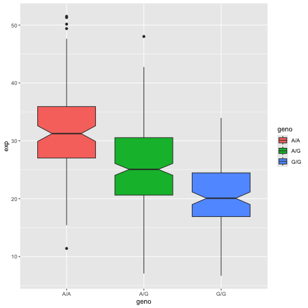

Imported the dataset into the R environment.

> Q13. Read this file into R and determine the sample size for each genotype and their corresponding median expression levels for each of these genotypes.


```r
# Determine the sample size for each genotype:

table(data$geno)
```

```
## 
## A/A A/G G/G 
## 108 233 121
```

There are 108 samples with the A/A genotype, 233 samples with the A/G genotype, and 121 with the G/G genotype.


```r
# Finding the median expression levels for each genotype:

library(dplyr)
data %>%
    group_by(geno) %>%
    summarize(expression=median(exp))
```

```
## # A tibble: 3 × 2
##   geno  expression
##   <chr>      <dbl>
## 1 A/A         31.2
## 2 A/G         25.1
## 3 G/G         20.1
```

Median expression levels of each genotype:

A/A = 31.25

A/G = 25.06

G/G = 20.07

> Q14. Generate a boxplot with a box per genotype, what could you infer from the relative expression value between A/A and G/G displayed in this plot? Does the SNP effect the expression of ORMDL3?


```r
library(ggplot2)

ggplot(data)+
  aes(x=geno,y=exp,fill=geno)+
  geom_boxplot(notch=TRUE)
```



The SNP has a significant effect on the expression of ORMDL3, supported by the fact that there is a significant decrease in expression levels between A/A and G/G.


