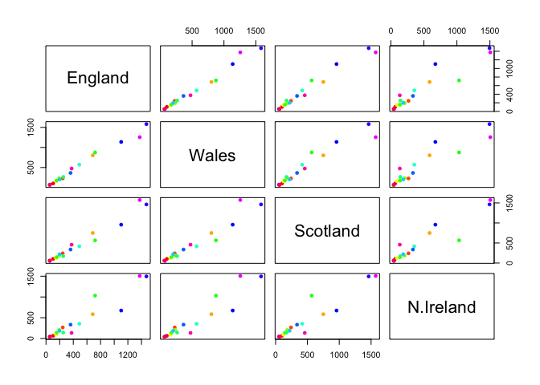

# Lab 7
Lindsey China (A17023629)

- [Clustering](#clustering)
- [Hierarchical Clustering](#hierarchical-clustering)
- [PCA Data](#pca-data)

Today we will start our multi part exploration of some key machine
learning methods. We will begin with clustering - finding groupings in
data, and then dimensional reduction.

## Clustering

Let’s start with “k-means” clustering. The main function in base R for
this `kmeans()`

``` r
# Make some data
hist(rnorm(100000, mean=3))
```


``` r
# Make a data set with X and Y coordinates
tmp <- c(rnorm(30, -3), rnorm(30, +3))
x <- cbind(x=tmp, y=rev(tmp))
plot(x)
```


Now let’s try out `kmeans()`

``` r
km <- kmeans(x, centers=2)
km
```

    K-means clustering with 2 clusters of sizes 30, 30

    Cluster means:
              x         y
    1 -3.248885  2.830274
    2  2.830274 -3.248885

    Clustering vector:
     [1] 1 1 1 1 1 1 1 1 1 1 1 1 1 1 1 1 1 1 1 1 1 1 1 1 1 1 1 1 1 1 2 2 2 2 2 2 2 2
    [39] 2 2 2 2 2 2 2 2 2 2 2 2 2 2 2 2 2 2 2 2 2 2

    Within cluster sum of squares by cluster:
    [1] 83.16391 83.16391
     (between_SS / total_SS =  87.0 %)

    Available components:

    [1] "cluster"      "centers"      "totss"        "withinss"     "tot.withinss"
    [6] "betweenss"    "size"         "iter"         "ifault"      

``` r
attributes(km)
```

    $names
    [1] "cluster"      "centers"      "totss"        "withinss"     "tot.withinss"
    [6] "betweenss"    "size"         "iter"         "ifault"      

    $class
    [1] "kmeans"

> Q. How many points in each cluster

``` r
km$size
```

    [1] 30 30

> Q. What component of your result object details cluster
> assignment/membership?

``` r
km$cluster
```

     [1] 1 1 1 1 1 1 1 1 1 1 1 1 1 1 1 1 1 1 1 1 1 1 1 1 1 1 1 1 1 1 2 2 2 2 2 2 2 2
    [39] 2 2 2 2 2 2 2 2 2 2 2 2 2 2 2 2 2 2 2 2 2 2

> Q. What are the centers/mean values of each cluster?

``` r
km$centers
```

              x         y
    1 -3.248885  2.830274
    2  2.830274 -3.248885

> Q. Make a plot of your data showing your clustering results.

``` r
# Assign different colors to each cluster
plot(x, col=km$cluster)
```


``` r
# Add a value to change the colors
plot(x, col=km$cluster+2)

# Highlight the center points of each cluster
# cex changes size of square, pch changes the shape of the point (15 is square, 16 is filled circle)
points(km$centers, col="red", pch=15, cex=3)
```


> Q. Run `kmeans()` again and cluster in 4 groups, plot the results.

``` r
km_4 <- kmeans(x, centers=4)
plot(x, col=km_4$cluster)
points(km_4$centers, col="lightblue4", pch=15, cex=2)
```


## Hierarchical Clustering

This form of clustering aims to reveal the structure in your data by
progressively grouping points into an ever smaller number of clusters.

The main function in base R for this is called `hclust()`. This function
does not take our input data directly but wants a “distance matrix” that
details how (dis)similar all our input data points are to each other.

``` r
hc <- hclust(dist(x))
hc
```


    Call:
    hclust(d = dist(x))

    Cluster method   : complete 
    Distance         : euclidean 
    Number of objects: 60 

The print out above is not very useful (unlike that from `kmeans()`) but
there is a useful `plot()` method

``` r
plot(hc)
abline(h=10, col="red")
```


To get my main result (cluster membership vector) I need to cut my tree
using the function `cutree()`

``` r
tree_cluster <- cutree(hc, h=10)
```

Plot the data, coloring it with the dendrogram cluster membership

``` r
plot(x, col=tree_cluster)
```


## PCA Data

``` r
url <- "https://tinyurl.com/UK-foods"
x <- read.csv(url)
```

Find dimensions of the dataset:

``` r
dim(x)
```

    [1] 17  5

Preview first six rows:

``` r
head(x)
```

                   X England Wales Scotland N.Ireland
    1         Cheese     105   103      103        66
    2  Carcass_meat      245   227      242       267
    3    Other_meat      685   803      750       586
    4           Fish     147   160      122        93
    5 Fats_and_oils      193   235      184       209
    6         Sugars     156   175      147       139

Shift column 1 to be the row names:

``` r
rownames(x) <- x[,1]
# Remove column 1 
x <- x[,-1]
head(x)
```

                   England Wales Scotland N.Ireland
    Cheese             105   103      103        66
    Carcass_meat       245   227      242       267
    Other_meat         685   803      750       586
    Fish               147   160      122        93
    Fats_and_oils      193   235      184       209
    Sugars             156   175      147       139

``` r
# Alternatively
x <- read.csv(url, row.names=1)
head(x)
```

                   England Wales Scotland N.Ireland
    Cheese             105   103      103        66
    Carcass_meat       245   227      242       267
    Other_meat         685   803      750       586
    Fish               147   160      122        93
    Fats_and_oils      193   235      184       209
    Sugars             156   175      147       139

``` r
barplot(as.matrix(x), beside=T, col=rainbow(nrow(x)))
```


Changing the beside argument to false results in the data being stacked
instead of aligned next to each other.

``` r
barplot(as.matrix(x), beside=F, col=rainbow(nrow(x)))
```


The pairs plot can be useful for small datasets:

``` r
#rainbow(nrow(x))
pairs(x, col=rainbow(nrow(x)), pch=16)
```



Pairs plots are helpful for small datasets but it can be lots of work to
interpret and gets intractable for larger datasets.

So PCA to the rescue…

The main function to do PCA in base R is called `prcomp()`. This
function wants the transpose of our data in this case.

``` r
# Transpose the data set with t(x)
pca <- prcomp(t(x))
summary(pca)
```

    Importance of components:
                                PC1      PC2      PC3       PC4
    Standard deviation     324.1502 212.7478 73.87622 2.921e-14
    Proportion of Variance   0.6744   0.2905  0.03503 0.000e+00
    Cumulative Proportion    0.6744   0.9650  1.00000 1.000e+00

``` r
attributes(pca)
```

    $names
    [1] "sdev"     "rotation" "center"   "scale"    "x"       

    $class
    [1] "prcomp"

``` r
pca$x
```

                     PC1         PC2        PC3           PC4
    England   -144.99315   -2.532999 105.768945 -9.152022e-15
    Wales     -240.52915 -224.646925 -56.475555  5.560040e-13
    Scotland   -91.86934  286.081786 -44.415495 -6.638419e-13
    N.Ireland  477.39164  -58.901862  -4.877895  1.329771e-13

A major CA result visualization is called a PCA plot, also known as a
score plot, biplot, PC1 vs. PC2 plot, or ordination plot (naming
typically depends on the field).

``` r
mycols <- c("orange", "red", "blue", "green")
plot(pca$x[,1], pca$x[,2], col=mycols, pch=16,
     xlab="PC1", ylab="PC2")
abline(h=0, v=0, col="gray")
```


Another important output from PCA is called the “loadings” vector or the
“rotation” component - this tells us how much the original variables
(the foods in this case) contribute to the new PCs.

``` r
pca$rotation
```

                                 PC1          PC2         PC3          PC4
    Cheese              -0.056955380  0.016012850  0.02394295 -0.409382587
    Carcass_meat         0.047927628  0.013915823  0.06367111  0.729481922
    Other_meat          -0.258916658 -0.015331138 -0.55384854  0.331001134
    Fish                -0.084414983 -0.050754947  0.03906481  0.022375878
    Fats_and_oils       -0.005193623 -0.095388656 -0.12522257  0.034512161
    Sugars              -0.037620983 -0.043021699 -0.03605745  0.024943337
    Fresh_potatoes       0.401402060 -0.715017078 -0.20668248  0.021396007
    Fresh_Veg           -0.151849942 -0.144900268  0.21382237  0.001606882
    Other_Veg           -0.243593729 -0.225450923 -0.05332841  0.031153231
    Processed_potatoes  -0.026886233  0.042850761 -0.07364902 -0.017379680
    Processed_Veg       -0.036488269 -0.045451802  0.05289191  0.021250980
    Fresh_fruit         -0.632640898 -0.177740743  0.40012865  0.227657348
    Cereals             -0.047702858 -0.212599678 -0.35884921  0.100043319
    Beverages           -0.026187756 -0.030560542 -0.04135860 -0.018382072
    Soft_drinks          0.232244140  0.555124311 -0.16942648  0.222319484
    Alcoholic_drinks    -0.463968168  0.113536523 -0.49858320 -0.273126013
    Confectionery       -0.029650201  0.005949921 -0.05232164  0.001890737

PCA looks to be a super useful method for giving us some inside into
high dimensional data that is difficult to examine in other ways.
