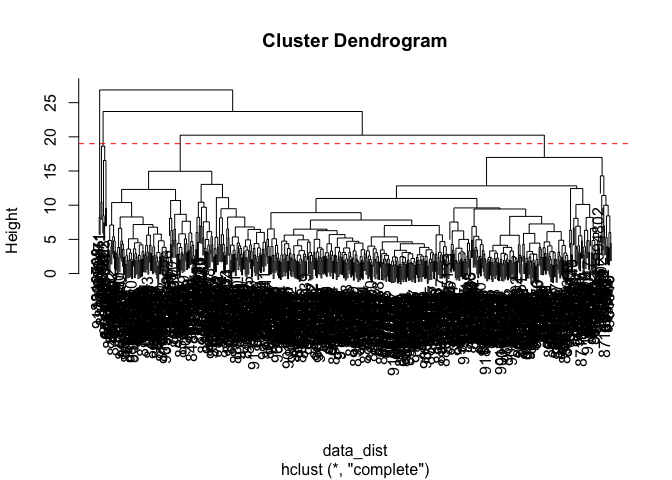
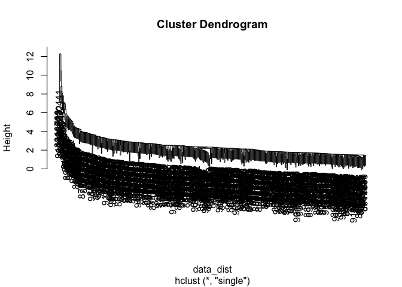
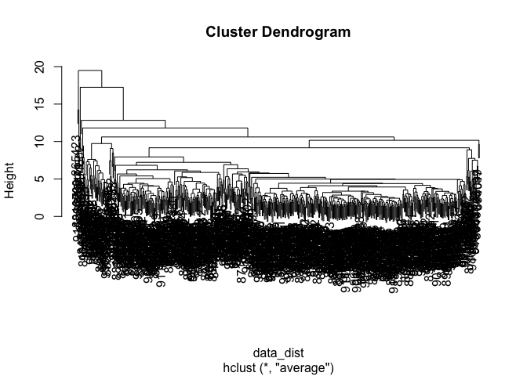
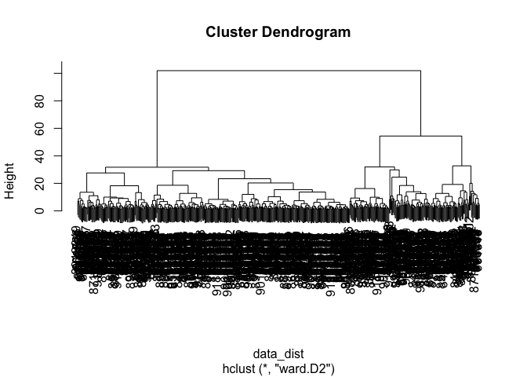
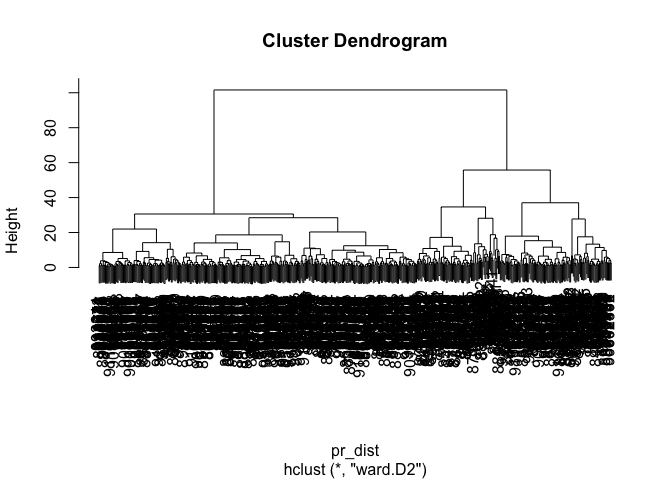
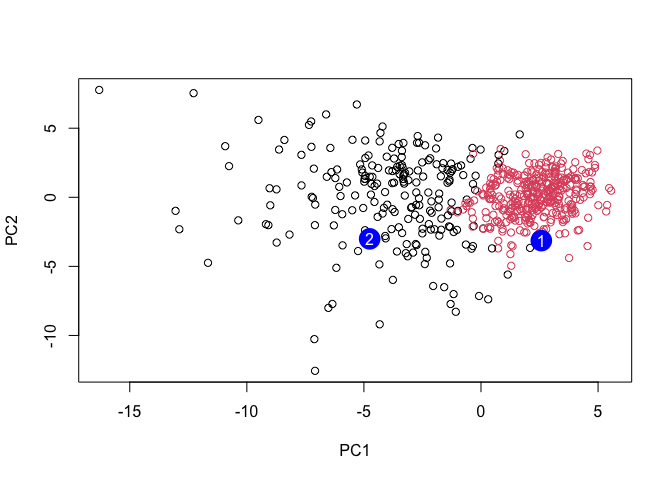

# Lab 8
Lindsey China (A17023629)

- [Importing and Formatting Data](#importing-and-formatting-data)
- [PCA on wisc.data](#pca-on-wisc.data)
- [Interpreting PCA Results](#interpreting-pca-results)
- [Variance Explained](#variance-explained)
- [Communicating PCA Results](#communicating-pca-results)
  - [Hierarchical Clustering](#hierarchical-clustering)
- [Selecting number of clusters](#selecting-number-of-clusters)
- [Using different methods](#using-different-methods)
  - [K-means clustering](#k-means-clustering)
  - [Combining Methods](#combining-methods)
- [Clustering on PCA results](#clustering-on-pca-results)
  - [Sensitivity and specificity](#sensitivity-and-specificity)
  - [Prediction](#prediction)

## Importing and Formatting Data

Need to import the Wisconsin cancer data for this project, after loading
it into the directory create a data frame to be used in the code:

``` r
fna.data <- "WisconsinCancer.csv"

wisc.df <- read.csv(fna.data, row.names=1)
```

``` r
head(wisc.df)
```

             diagnosis radius_mean texture_mean perimeter_mean area_mean
    842302           M       17.99        10.38         122.80    1001.0
    842517           M       20.57        17.77         132.90    1326.0
    84300903         M       19.69        21.25         130.00    1203.0
    84348301         M       11.42        20.38          77.58     386.1
    84358402         M       20.29        14.34         135.10    1297.0
    843786           M       12.45        15.70          82.57     477.1
             smoothness_mean compactness_mean concavity_mean concave.points_mean
    842302           0.11840          0.27760         0.3001             0.14710
    842517           0.08474          0.07864         0.0869             0.07017
    84300903         0.10960          0.15990         0.1974             0.12790
    84348301         0.14250          0.28390         0.2414             0.10520
    84358402         0.10030          0.13280         0.1980             0.10430
    843786           0.12780          0.17000         0.1578             0.08089
             symmetry_mean fractal_dimension_mean radius_se texture_se perimeter_se
    842302          0.2419                0.07871    1.0950     0.9053        8.589
    842517          0.1812                0.05667    0.5435     0.7339        3.398
    84300903        0.2069                0.05999    0.7456     0.7869        4.585
    84348301        0.2597                0.09744    0.4956     1.1560        3.445
    84358402        0.1809                0.05883    0.7572     0.7813        5.438
    843786          0.2087                0.07613    0.3345     0.8902        2.217
             area_se smoothness_se compactness_se concavity_se concave.points_se
    842302    153.40      0.006399        0.04904      0.05373           0.01587
    842517     74.08      0.005225        0.01308      0.01860           0.01340
    84300903   94.03      0.006150        0.04006      0.03832           0.02058
    84348301   27.23      0.009110        0.07458      0.05661           0.01867
    84358402   94.44      0.011490        0.02461      0.05688           0.01885
    843786     27.19      0.007510        0.03345      0.03672           0.01137
             symmetry_se fractal_dimension_se radius_worst texture_worst
    842302       0.03003             0.006193        25.38         17.33
    842517       0.01389             0.003532        24.99         23.41
    84300903     0.02250             0.004571        23.57         25.53
    84348301     0.05963             0.009208        14.91         26.50
    84358402     0.01756             0.005115        22.54         16.67
    843786       0.02165             0.005082        15.47         23.75
             perimeter_worst area_worst smoothness_worst compactness_worst
    842302            184.60     2019.0           0.1622            0.6656
    842517            158.80     1956.0           0.1238            0.1866
    84300903          152.50     1709.0           0.1444            0.4245
    84348301           98.87      567.7           0.2098            0.8663
    84358402          152.20     1575.0           0.1374            0.2050
    843786            103.40      741.6           0.1791            0.5249
             concavity_worst concave.points_worst symmetry_worst
    842302            0.7119               0.2654         0.4601
    842517            0.2416               0.1860         0.2750
    84300903          0.4504               0.2430         0.3613
    84348301          0.6869               0.2575         0.6638
    84358402          0.4000               0.1625         0.2364
    843786            0.5355               0.1741         0.3985
             fractal_dimension_worst
    842302                   0.11890
    842517                   0.08902
    84300903                 0.08758
    84348301                 0.17300
    84358402                 0.07678
    843786                   0.12440

The first column won’t be used here, it is a pathologist diagnosis and
is basically the answer to if cells are malignant or benign. Reformat
the dataset to remove the first column:

``` r
wisc.data <- wisc.df[,-1]
```

Need to create a new vector, “Diagnosis”, with the data from the
diagnosis column of the original set to check our results later:

``` r
# To create a factor, need to use the tidyverse package
library(tidyverse)
```

    ── Attaching core tidyverse packages ──────────────────────── tidyverse 2.0.0 ──
    ✔ dplyr     1.1.4     ✔ readr     2.1.5
    ✔ forcats   1.0.0     ✔ stringr   1.5.1
    ✔ ggplot2   3.5.1     ✔ tibble    3.2.1
    ✔ lubridate 1.9.3     ✔ tidyr     1.3.1
    ✔ purrr     1.0.2     
    ── Conflicts ────────────────────────────────────────── tidyverse_conflicts() ──
    ✖ dplyr::filter() masks stats::filter()
    ✖ dplyr::lag()    masks stats::lag()
    ℹ Use the conflicted package (<http://conflicted.r-lib.org/>) to force all conflicts to become errors

``` r
# Specify the diagnosis levels/variables present in the list
diagnosis_levels <- c("B","M")

# Write the factor
diagnosis <- factor(wisc.df$diagnosis, levels=diagnosis_levels)
head(diagnosis)
```

    [1] M M M M M M
    Levels: B M

> Q1. How many observations are in the dataset?

``` r
dim(wisc.df)
```

    [1] 569  31

569 Observations of 31 variables

> Q2. How many of the observations have a malignant diagnosis?

``` r
table(wisc.df$diagnosis)
```


      B   M 
    357 212 

212 Observations are malignant

> Q3. How many variables/features in the data are suffixed with \_mean?

``` r
length((grep("_mean", names(wisc.df))))
```

    [1] 10

10 Variables contain \_mean

## PCA on wisc.data

To determine if data needs to be scaled, check the column means and
standard deviation:

``` r
colMeans(wisc.data)
```

                radius_mean            texture_mean          perimeter_mean 
               1.412729e+01            1.928965e+01            9.196903e+01 
                  area_mean         smoothness_mean        compactness_mean 
               6.548891e+02            9.636028e-02            1.043410e-01 
             concavity_mean     concave.points_mean           symmetry_mean 
               8.879932e-02            4.891915e-02            1.811619e-01 
     fractal_dimension_mean               radius_se              texture_se 
               6.279761e-02            4.051721e-01            1.216853e+00 
               perimeter_se                 area_se           smoothness_se 
               2.866059e+00            4.033708e+01            7.040979e-03 
             compactness_se            concavity_se       concave.points_se 
               2.547814e-02            3.189372e-02            1.179614e-02 
                symmetry_se    fractal_dimension_se            radius_worst 
               2.054230e-02            3.794904e-03            1.626919e+01 
              texture_worst         perimeter_worst              area_worst 
               2.567722e+01            1.072612e+02            8.805831e+02 
           smoothness_worst       compactness_worst         concavity_worst 
               1.323686e-01            2.542650e-01            2.721885e-01 
       concave.points_worst          symmetry_worst fractal_dimension_worst 
               1.146062e-01            2.900756e-01            8.394582e-02 

``` r
apply(wisc.data,2,sd)
```

                radius_mean            texture_mean          perimeter_mean 
               3.524049e+00            4.301036e+00            2.429898e+01 
                  area_mean         smoothness_mean        compactness_mean 
               3.519141e+02            1.406413e-02            5.281276e-02 
             concavity_mean     concave.points_mean           symmetry_mean 
               7.971981e-02            3.880284e-02            2.741428e-02 
     fractal_dimension_mean               radius_se              texture_se 
               7.060363e-03            2.773127e-01            5.516484e-01 
               perimeter_se                 area_se           smoothness_se 
               2.021855e+00            4.549101e+01            3.002518e-03 
             compactness_se            concavity_se       concave.points_se 
               1.790818e-02            3.018606e-02            6.170285e-03 
                symmetry_se    fractal_dimension_se            radius_worst 
               8.266372e-03            2.646071e-03            4.833242e+00 
              texture_worst         perimeter_worst              area_worst 
               6.146258e+00            3.360254e+01            5.693570e+02 
           smoothness_worst       compactness_worst         concavity_worst 
               2.283243e-02            1.573365e-01            2.086243e-01 
       concave.points_worst          symmetry_worst fractal_dimension_worst 
               6.573234e-02            6.186747e-02            1.806127e-02 

Execute the PCA:

``` r
wisc.pr <- prcomp(wisc.data, scale. = TRUE)
summary(wisc.pr)
```

    Importance of components:
                              PC1    PC2     PC3     PC4     PC5     PC6     PC7
    Standard deviation     3.6444 2.3857 1.67867 1.40735 1.28403 1.09880 0.82172
    Proportion of Variance 0.4427 0.1897 0.09393 0.06602 0.05496 0.04025 0.02251
    Cumulative Proportion  0.4427 0.6324 0.72636 0.79239 0.84734 0.88759 0.91010
                               PC8    PC9    PC10   PC11    PC12    PC13    PC14
    Standard deviation     0.69037 0.6457 0.59219 0.5421 0.51104 0.49128 0.39624
    Proportion of Variance 0.01589 0.0139 0.01169 0.0098 0.00871 0.00805 0.00523
    Cumulative Proportion  0.92598 0.9399 0.95157 0.9614 0.97007 0.97812 0.98335
                              PC15    PC16    PC17    PC18    PC19    PC20   PC21
    Standard deviation     0.30681 0.28260 0.24372 0.22939 0.22244 0.17652 0.1731
    Proportion of Variance 0.00314 0.00266 0.00198 0.00175 0.00165 0.00104 0.0010
    Cumulative Proportion  0.98649 0.98915 0.99113 0.99288 0.99453 0.99557 0.9966
                              PC22    PC23   PC24    PC25    PC26    PC27    PC28
    Standard deviation     0.16565 0.15602 0.1344 0.12442 0.09043 0.08307 0.03987
    Proportion of Variance 0.00091 0.00081 0.0006 0.00052 0.00027 0.00023 0.00005
    Cumulative Proportion  0.99749 0.99830 0.9989 0.99942 0.99969 0.99992 0.99997
                              PC29    PC30
    Standard deviation     0.02736 0.01153
    Proportion of Variance 0.00002 0.00000
    Cumulative Proportion  1.00000 1.00000

> Q4. From the results, what proportion of the original variance is
> captured by the first principal components (PC1)?

44.27% of the variance is captured by PC1.

> Q5. How many principle components are required to describe at least
> 70% of the original variance in the data?

3 PCs are required to capture 70% of the variance.

> Q6. How many principal components are required to describe at least
> 90% of the original variance in the data?

7 PCs are required to capture 90% of the variance.

# Interpreting PCA Results

Use a biplot to visualize the results of the PCA:

``` r
biplot(wisc.pr)
```


> Q7. What stands out about this plot? Is it easy to understand? Why?

It is very difficult to understand, the data points are all on top of
each other and it is difficult to see a pattern or meaning in the graph.

Try a scatter plot colored by the first two PCAs:

``` r
plot(wisc.pr$x,col=diagnosis,
     xlab="PC1",ylab="PC2")
```


We can use ggplot2 to make an even better representation of this data:

``` r
# Create a data frame for ggplot to use
df <- as.data.frame(wisc.pr$x)
df$diagnosis <- diagnosis

library(ggplot2)
ggplot(df)+
  aes(PC1, PC2, col=diagnosis)+
  geom_point()
```


# Variance Explained

Calculate the variance from the PCA:

``` r
pr.var <- wisc.pr$sdev^2
head(pr.var)
```

    [1] 13.281608  5.691355  2.817949  1.980640  1.648731  1.207357

Find the variance explained by each PC:

``` r
# Variance explained by each principal component, stored as pve
pve <- pr.var/sum(pr.var)

# Plot pve
plot(pve, xlab="Principal Component",ylab="Proportion of Variance Explained",ylim=c(0,1),type="o")
```


Alternative plot of the same data with a data driven y-axis:

``` r
barplot(pve,ylab="Percent of Variance Explained",names.arg=paste0("PC",1:length(pve)),las=2,axes=FALSE)
axis(2,at=pve,labels=round(pve,2)*100)
```


# Communicating PCA Results

> Q9. For the first PC, what is the compenent of the loading vector for
> the feature concave.points_mean?

-0.2608538

``` r
head(wisc.pr$rotation[,1],8)
```

            radius_mean        texture_mean      perimeter_mean           area_mean 
             -0.2189024          -0.1037246          -0.2275373          -0.2209950 
        smoothness_mean    compactness_mean      concavity_mean concave.points_mean 
             -0.1425897          -0.2392854          -0.2584005          -0.2608538 

> Q10. What is the minimum number of principal components required to
> explain 80% of the variance in the data?

At least 5 PCs are required to explain 80% of the data

## Hierarchical Clustering

Scale the data to prepare it for hierarchical clustering:

``` r
data.scaled <- scale(wisc.data)
```

Calculate the euclidean distance between all pairs of observations:

``` r
data_dist <- dist(data.scaled, method="euclidean")
```

Create a hierarchical clustering model using complete linkage, manually
specify the method to hclust() and assign the results to wisc.hclust:

``` r
wisc.hclust <- hclust(data_dist, method="complete")
```

> Q11. Using the plot() and abline() function, what is the height at
> which the clustering model has 4 clusters?

``` r
plot(wisc.hclust)
abline(h=19, col="red", lty=2)
```



At a height of 19 the clustering model is broken up into 4 clusters.

# Selecting number of clusters

Here we’ll compare the outputs of hierarchical clustering with the
actual diagnoses. Because we have it in the dataset we can check the
performance of our clustering model.

Use cutree() to cut the tree into 4 clusters, assign to
wisc.hclust.clusters:

``` r
wisc.hclust.clusters <- cutree(wisc.hclust, h=19)
```

Use the table function to compare to the actual diagnoses:

``` r
table(wisc.hclust.clusters, diagnosis)
```

                        diagnosis
    wisc.hclust.clusters   B   M
                       1  12 165
                       2   2   5
                       3 343  40
                       4   0   2

> Q12. Can you find a better cluster vs diagnoses match by cutting into
> a different number of clusters between 2 and 10?

``` r
# 2 Clusters:
wisc.hclust_2 <- cutree(wisc.hclust, h=25)
table(wisc.hclust_2, diagnosis)
```

                 diagnosis
    wisc.hclust_2   B   M
                1 357 210
                2   0   2

``` r
# 3 Clusters:
wisc.hclust_3 <- cutree(wisc.hclust, h=22)
table(wisc.hclust_3, diagnosis)
```

                 diagnosis
    wisc.hclust_3   B   M
                1 355 205
                2   2   5
                3   0   2

``` r
# 5 Clusters:
wisc.hclust_5 <- cutree(wisc.hclust, h=18)
table(wisc.hclust_5, diagnosis)
```

                 diagnosis
    wisc.hclust_5   B   M
                1  12 165
                2   0   5
                3 343  40
                4   2   0
                5   0   2

``` r
# 10 Clusters:
wisc.hclust_10 <- cutree(wisc.hclust, h=13)
table(wisc.hclust_10, diagnosis)
```

                  diagnosis
    wisc.hclust_10   B   M
                1   12  86
                2    0  59
                3    0   3
                4  331  39
                5    0  20
                6    2   0
                7   12   0
                8    0   2
                9    0   2
                10   0   1

Cutting into two or three clusters gives one cluster containing most of
the results, with the other clusters only containing a few values.
Increasing above four clusters causes you to start to lose the defined
clusters containing either the majority of the B or M values.

# Using different methods

There are different *“methods”* we can use to combine points during
hierarchical clustering procedures. These include “single”, “complete”,
“average”, and “ward.D2”.

> Q13. Which method gives your favorite results for the same data.dist
> dataset? Explain your reasoning.

``` r
wisc.hclust_single <- hclust(data_dist, method="single")
plot(wisc.hclust_single)
```



``` r
wisc.hclust_average <- hclust(data_dist, method="average")
plot(wisc.hclust_average)
```



``` r
wisc.hclust_w.D2 <- hclust(data_dist, method="ward.D2")
plot(wisc.hclust_w.D2)
```



I like the ward.D2 combination, it leaves all of the individual values
on the same level of clusters which I think makes the data look more
clean.

## K-means clustering

``` r
wisc.km <- kmeans(wisc.data, centers = 2)
table(wisc.km$cluster, diagnosis)
```

       diagnosis
          B   M
      1   1 130
      2 356  82

> Q14. How well does k-means separate the two diagnoses? How does it
> compare to hclust()?

It separates the benign diagnoses incredibly well, with only 1 ending up
in a separate cluster. You lose a lot of data for the malignant
diagnoses though. It is both better and worse compared to the hclust()
model depending on how you look at it.

Use table() to compare k-means clusters with hierarchical clusters.

``` r
table(wisc.hclust.clusters, wisc.km$cluster)
```

                        
    wisc.hclust.clusters   1   2
                       1 109  68
                       2   2   5
                       3  18 365
                       4   2   0

## Combining Methods

# Clustering on PCA results

Recall that the PCA required significantly fewer features to describe
70%, 80%, and 95% of the variability. PCA other has other benefits like
normalizing data, avoiding over-fitting, and uncorrelating variables.
Let’s see if PCA improves or degrades the performance of hierarchical
clustering.

Create a hierarchical clustering model using ward.D2 linkage to describe
at least 90% of variability.

``` r
pr_dist <- dist(wisc.pr$x[,1:7])
pr.hclust <- hclust(pr_dist, method="ward.D2")
plot(pr.hclust)
```



This doesn’t look anymore promising than our previous clustering models.
Are the two main groups here malignant and benign?

``` r
grps <- cutree(pr.hclust, k=2)
table(grps)
```

    grps
      1   2 
    216 353 

``` r
table(grps, diagnosis)
```

        diagnosis
    grps   B   M
       1  28 188
       2 329  24

``` r
plot(wisc.pr$x, col=grps)
```


``` r
# Or:
plot(wisc.pr$x[,1:2], col=diagnosis)
```


Use the distance along the first 7 PCs for clustering:

``` r
wisc.pr.hclust <- hclust(pr_dist, method = "ward.D2")

# Cut this model into 2 clusters:
wisc.pr.hclust.clusters <- cutree(wisc.pr.hclust, k=2)
```

Using table() compare the results of the new hierarchical model with the
actual diagnoses.

``` r
table(wisc.pr.hclust.clusters, diagnosis)
```

                           diagnosis
    wisc.pr.hclust.clusters   B   M
                          1  28 188
                          2 329  24

> Q15. How well does the newly created model with four clusters separate
> the two diagnoses?

It works the same as the previous “grps” method. Still better than the
original models done with the “complete”.

> Q16. How well do the k-means and hierarchical clustering models do in
> terms of separating diagnoses? Use table() to compare the output of
> each model.

``` r
table(wisc.km$cluster, diagnosis)
```

       diagnosis
          B   M
      1   1 130
      2 356  82

``` r
table(wisc.hclust.clusters, diagnosis)
```

                        diagnosis
    wisc.hclust.clusters   B   M
                       1  12 165
                       2   2   5
                       3 343  40
                       4   0   2

Both seem to struggle to really separate the benign diagnoses, though
the hclust() model does a slightly better job at this. Even then the
hclust() model does not have as good of a separation for benign
diagnoses compared to the kmeans. Both have benefits and consequences.

## Sensitivity and specificity

Sensitivity: a test’s ability to correctly detect ill patients with the
condition. In this case, the number of samples in the cluster identified
as predominantly malignant divided by the total number of know malignant
samples (TP/(TP+FN))

Specificity: a test’s ability to correctly reject healthy patients. In
this case, the proportion of benign samples in the cluster identified as
predominantly benign that are known to be benign (TN/(TN+FN))

> Q17. Which of your analysis procedures resulted in a clustering model
> with the best specificity? Sensitivity?

``` r
# Kmean sensitivity and specificity
(130/212)
```

    [1] 0.6132075

``` r
(356/357)
```

    [1] 0.9971989

``` r
# hclust sensitivity and specificity
(165/212)
```

    [1] 0.7783019

``` r
(343/357)
```

    [1] 0.9607843

K-means produced the more specific but less sensitive model compared to
hclust.

## Prediction

We’ll use predict() function that will take our PCA model from before
and new cancer cell data and project that data onto our PCA space.

``` r
url <- "https://tinyurl.com/new-samples-CSV"
new <- read.csv(url)
npc <- predict(wisc.pr, newdata=new)
head(npc)
```

               PC1       PC2        PC3        PC4       PC5        PC6        PC7
    [1,]  2.576616 -3.135913  1.3990492 -0.7631950  2.781648 -0.8150185 -0.3959098
    [2,] -4.754928 -3.009033 -0.1660946 -0.6052952 -1.140698 -1.2189945  0.8193031
                PC8       PC9       PC10      PC11      PC12      PC13     PC14
    [1,] -0.2307350 0.1029569 -0.9272861 0.3411457  0.375921 0.1610764 1.187882
    [2,] -0.3307423 0.5281896 -0.4855301 0.7173233 -1.185917 0.5893856 0.303029
              PC15       PC16        PC17        PC18        PC19       PC20
    [1,] 0.3216974 -0.1743616 -0.07875393 -0.11207028 -0.08802955 -0.2495216
    [2,] 0.1299153  0.1448061 -0.40509706  0.06565549  0.25591230 -0.4289500
               PC21       PC22       PC23       PC24        PC25         PC26
    [1,]  0.1228233 0.09358453 0.08347651  0.1223396  0.02124121  0.078884581
    [2,] -0.1224776 0.01732146 0.06316631 -0.2338618 -0.20755948 -0.009833238
                 PC27        PC28         PC29         PC30
    [1,]  0.220199544 -0.02946023 -0.015620933  0.005269029
    [2,] -0.001134152  0.09638361  0.002795349 -0.019015820

``` r
plot(wisc.pr$x[,1:2], col=grps)
points(npc[,1], npc[,2], col="blue", pch=16, cex=3)
text(npc[,1], npc[,2], c(1,2), col = "white")
```



> Q18. Which of these new patients should we prioritize for follow up
> based on the results?

Patients in group 2 should be prioritized for follow up appointments
since they’re more likely to have a malignant diagnosis.
