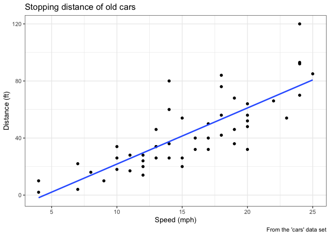
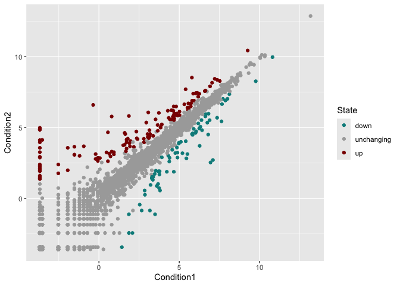
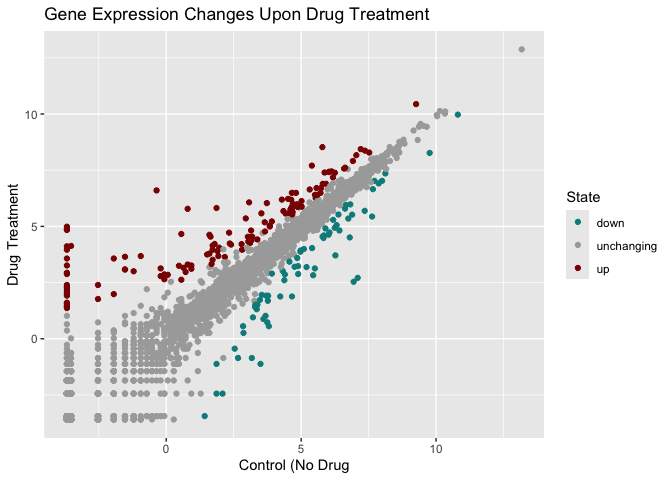
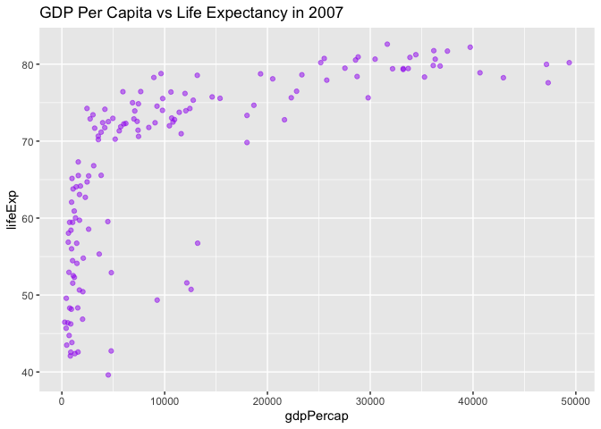
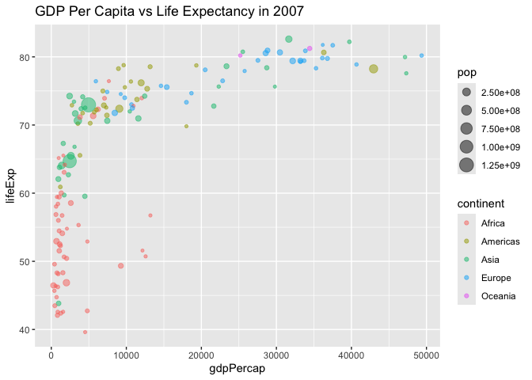
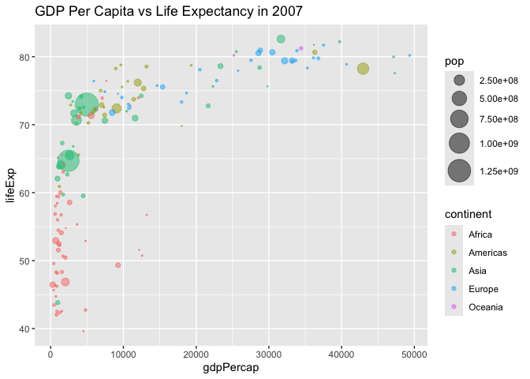
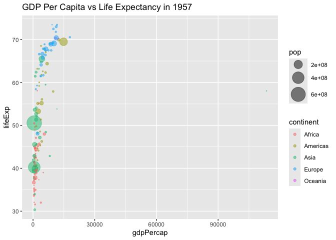
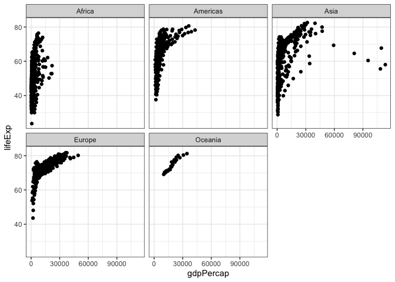

# Class 5: Data Visualization with GGPLOT
Lindsey China (PID: A17023629)

- [A more complicated scatter plot](#a-more-complicated-scatter-plot)
- [Exploring the gapminder dataset](#exploring-the-gapminder-dataset)

Today we will have our first play with the **ggplot2** package - one of
the most popular graphics packages on the planet.

There are many plotting sustems in R. These include so-called *“base”*
plotting/graphics.

``` r
plot(cars)
```


Distance to stop (feet) vs speed (mph)

Base plot is generally rather short code and somewhat dull plots - but
it is always there for you and is fast for big data sets.

If I want to use **ggplot2** it takes some more work.

``` r
library(ggplot2)
ggplot(cars)
```


I need to install the package first to my computer. To do this I can use
the function `install.packages("ggplot2")`

Every ggplot has at least 3 things:

- **data** (the data.frame you with the data you want to plot)
- **aes** (the aesthetic mapping of the data to the plot)
- **geom** (how do you want the plot to look, points, lines, etc.)

``` r
head(cars)
```

      speed dist
    1     4    2
    2     4   10
    3     7    4
    4     7   22
    5     8   16
    6     9   10

``` r
bp <- ggplot(cars)+
  aes(x=speed, y=dist)+
  geom_point()
```

**Changing to a linear model and removing the standard error shading:**

``` r
ggplot(cars)+
  aes(x=speed, y=dist)+
  geom_point()+
  geom_smooth(method = lm, se = FALSE)
```

    `geom_smooth()` using formula = 'y ~ x'


**Adding in label annotations and changing the theme to black and
white:**

``` r
#Don't put a space after 'bp' will result in an error
bp+geom_smooth(method = lm, se = FALSE)+
  labs(title = "Stopping distance of old cars", 
       x = "Speed (mph)", 
       y = "Distance (ft)",
       caption = "From the 'cars' data set") +
  theme_bw()
```

    `geom_smooth()` using formula = 'y ~ x'



## A more complicated scatter plot

**Here we make a plot of gene expression data:**

``` r
url <- "https://bioboot.github.io/bimm143_S20/class-material/up_down_expression.txt"
genes <- read.delim(url)
head(genes)
```

            Gene Condition1 Condition2      State
    1      A4GNT -3.6808610 -3.4401355 unchanging
    2       AAAS  4.5479580  4.3864126 unchanging
    3      AASDH  3.7190695  3.4787276 unchanging
    4       AATF  5.0784720  5.0151916 unchanging
    5       AATK  0.4711421  0.5598642 unchanging
    6 AB015752.4 -3.6808610 -3.5921390 unchanging

``` r
# Number of genes in the data set:
nrow(genes)
```

    [1] 5196

``` r
# Name and number of the columns in the data set:
colnames(genes)
```

    [1] "Gene"       "Condition1" "Condition2" "State"     

``` r
ncol(genes)
```

    [1] 4

``` r
# Number of genes in each state:
table(genes$State)
```


          down unchanging         up 
            72       4997        127 

``` r
# Percent of total genes in each state:
round(table(genes$State)/nrow(genes)*100,2)
```


          down unchanging         up 
          1.39      96.17       2.44 

``` r
# Alternate method, just showing percent upregulated:
n.gene <- nrow(genes)
n.up <- sum(genes$State=="up")

up.percent <- n.up/n.gene*100
round(up.percent, 2)
```

    [1] 2.44

**Graph the data set:**

``` r
ggplot(genes)+
  aes(x=Condition1, y=Condition2)+
  geom_point()
```


**Mapping State column to point color:**

``` r
p <- ggplot(genes)+
  aes(x=Condition1, y=Condition2, col=State)+
  geom_point()
p
```


**Changing the colors in the graph:**

``` r
p_color <- p+scale_color_manual(values=c("darkcyan","darkgray","darkred"))
p_color
```



**Adding in labels:**

``` r
p_color+labs(x="Control (No Drug",
           y="Drug Treatment",
           title="Gene Expression Changes Upon Drug Treatment")
```



## Exploring the gapminder dataset

**Here we will load up the gapminder dataset**

``` r
url <- "https://raw.githubusercontent.com/jennybc/gapminder/master/inst/extdata/gapminder.tsv"

gapminder <- read.delim(url)
```

``` r
head(gapminder)
```

          country continent year lifeExp      pop gdpPercap
    1 Afghanistan      Asia 1952  28.801  8425333  779.4453
    2 Afghanistan      Asia 1957  30.332  9240934  820.8530
    3 Afghanistan      Asia 1962  31.997 10267083  853.1007
    4 Afghanistan      Asia 1967  34.020 11537966  836.1971
    5 Afghanistan      Asia 1972  36.088 13079460  739.9811
    6 Afghanistan      Asia 1977  38.438 14880372  786.1134

**Q. How many entry rows and columns are in this dataset?**

``` r
nrow(gapminder)
```

    [1] 1704

``` r
ncol(gapminder)
```

    [1] 6

``` r
# Or:
dim(gapminder)
```

    [1] 1704    6

**Q. What years are included in the dataset?**

``` r
table(gapminder$year)
```


    1952 1957 1962 1967 1972 1977 1982 1987 1992 1997 2002 2007 
     142  142  142  142  142  142  142  142  142  142  142  142 

**Q. How many continents are in the dataset?**

``` r
# Table gives a count of how many entries fall under each continent:
table(gapminder$continent)
```


      Africa Americas     Asia   Europe  Oceania 
         624      300      396      360       24 

``` r
# Use the 'Unique' function to get just the name of each unique country in the dataset:
unique(gapminder$continent)
```

    [1] "Asia"     "Europe"   "Africa"   "Americas" "Oceania" 

``` r
# Use 'length' to get number of continents instead of a list of names:
length(unique(gapminder$continent))
```

    [1] 5

**Q. How many countries are in the dataset?**

``` r
length(unique(gapminder$country))
```

    [1] 142

**Focus dataset on a single year (2007):**

``` r
library(dplyr)
```


    Attaching package: 'dplyr'

    The following objects are masked from 'package:stats':

        filter, lag

    The following objects are masked from 'package:base':

        intersect, setdiff, setequal, union

``` r
gapminder_2007 <- gapminder %>% filter(year==2007)
```

**Create a graph for GDP vs life expectancy:**

``` r
ggplot(gapminder_2007)+
  aes(x=gdpPercap, y=lifeExp)+
  geom_point(alpha=0.5, col="purple")+
  labs(title="GDP Per Capita vs Life Expectancy in 2007")
```



**Adding more variables to the graph:**

``` r
ggplot(gapminder_2007)+
  aes(x=gdpPercap, y=lifeExp, color=continent, size=pop)+
  geom_point(alpha=0.5)+
  labs(title="GDP Per Capita vs Life Expectancy in 2007")
```



**Changing the size of the points:**

``` r
ggplot(gapminder_2007) + 
  geom_point(aes(x = gdpPercap, y = lifeExp,
                 size = pop, color=continent), alpha=0.5) +
  scale_size_area(max_size = 10)+
  labs(title="GDP Per Capita vs Life Expectancy in 2007")
```



**Graphing the data from 1957:**

``` r
gapminder_1957 <- gapminder %>% filter(year==1957)
ggplot(gapminder_1957)+
  geom_point(aes(x=gdpPercap, y=lifeExp, color=continent, size=pop), alpha=0.5)+
  scale_size_area(max_size=10)+
  labs(title="GDP Per Capita vs Life Expectancy in 1957")
```



**Facet command to display multiple graphs at once:**

``` r
ggplot(gapminder)+
  aes(x=gdpPercap, y=lifeExp)+
  geom_point()+
  facet_wrap(~continent)+
  theme_bw()
```


