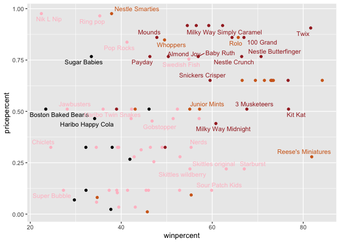
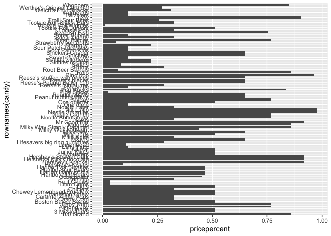
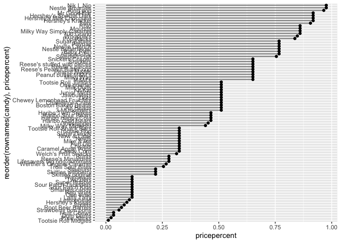
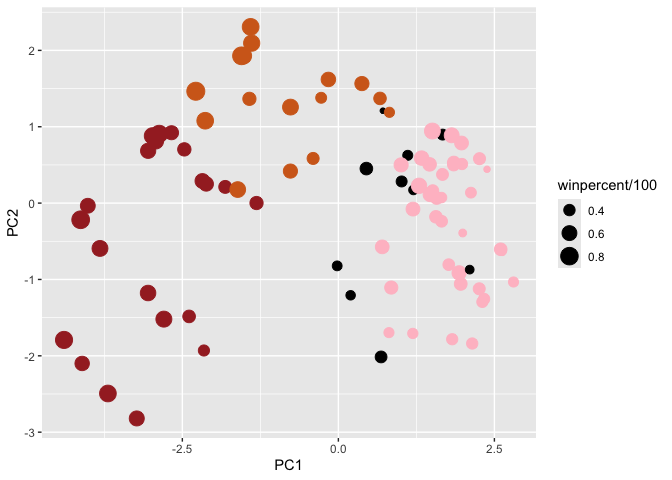
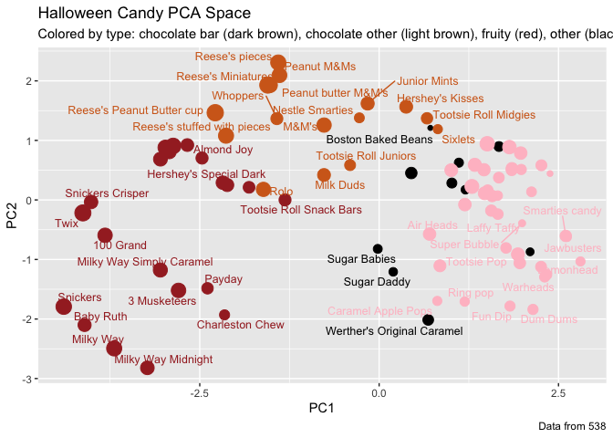

# Lab 9
Lindsey China (A17023629)

- [Importing candy data](#importing-candy-data)
  - [What is in the dataset?](#what-is-in-the-dataset)
- [What is your favorite candy?](#what-is-your-favorite-candy)
  - [The skim() function](#the-skim-function)
- [Overall Candy Rankings](#overall-candy-rankings)
  - [Time to add some useful color](#time-to-add-some-useful-color)
- [Taking a look at pricepercent](#taking-a-look-at-pricepercent)
- [Exploring Correlation Structure](#exploring-correlation-structure)
- [Principle component analysis](#principle-component-analysis)

# Importing candy data

First step is to import the data from FiveThirtyEight’s polls through
GitHub.

``` r
# Import the data set, save as candy_file:
url <- "https://raw.githubusercontent.com/fivethirtyeight/data/master/candy-power-ranking/candy-data.csv"
candy_file <- read.csv(url)

# Format the column titles:
candy = data.frame(candy_file, row.names=1)
head(candy)
```

                 chocolate fruity caramel peanutyalmondy nougat crispedricewafer
    100 Grand            1      0       1              0      0                1
    3 Musketeers         1      0       0              0      1                0
    One dime             0      0       0              0      0                0
    One quarter          0      0       0              0      0                0
    Air Heads            0      1       0              0      0                0
    Almond Joy           1      0       0              1      0                0
                 hard bar pluribus sugarpercent pricepercent winpercent
    100 Grand       0   1        0        0.732        0.860   66.97173
    3 Musketeers    0   1        0        0.604        0.511   67.60294
    One dime        0   0        0        0.011        0.116   32.26109
    One quarter     0   0        0        0.011        0.511   46.11650
    Air Heads       0   0        0        0.906        0.511   52.34146
    Almond Joy      0   1        0        0.465        0.767   50.34755

## What is in the dataset?

> Q1. How many different candy types are in the dataset?

``` r
nrow(candy)
```

    [1] 85

85 types of candy are listed.

> Q2. How many fruity candy types are in the dataset?

``` r
table(candy$fruity)
```


     0  1 
    47 38 

1 = true, there are 38 fruity candies in the dataset.

# What is your favorite candy?

The dataset includes the variable `winpercent`, for any given candy this
is the percent of people who prefer this candy over another randomly
chosen one. Higher value indicates a more popular candy. We can find the
value for Twix using its name to access its row of the dataset.

``` r
candy["Twix",]$winpercent
```

    [1] 81.64291

> Q3. What is your favorite candy in the dataset and what is its
> `winpercent` value?

``` r
candy["M&M's",]$winpercent
```

    [1] 66.57458

> Q4. What is the `winpercent` value for “Kit Kat”?

``` r
candy["Kit Kat",]$winpercent
```

    [1] 76.7686

> Q5. What is the `winpercent` value for “Tootsie Roll Snack Bars”?

``` r
candy["Tootsie Roll Snack Bars",]$winpercent
```

    [1] 49.6535

## The skim() function

The skimr package has a function that can give a quick overview of the
dataset.

``` r
library("skimr")
skim(candy)
```

|                                                  |       |
|:-------------------------------------------------|:------|
| Name                                             | candy |
| Number of rows                                   | 85    |
| Number of columns                                | 12    |
| \_\_\_\_\_\_\_\_\_\_\_\_\_\_\_\_\_\_\_\_\_\_\_   |       |
| Column type frequency:                           |       |
| numeric                                          | 12    |
| \_\_\_\_\_\_\_\_\_\_\_\_\_\_\_\_\_\_\_\_\_\_\_\_ |       |
| Group variables                                  | None  |

Data summary

**Variable type: numeric**

| skim_variable    | n_missing | complete_rate |  mean |    sd |    p0 |   p25 |   p50 |   p75 |  p100 | hist  |
|:-----------------|----------:|--------------:|------:|------:|------:|------:|------:|------:|------:|:------|
| chocolate        |         0 |             1 |  0.44 |  0.50 |  0.00 |  0.00 |  0.00 |  1.00 |  1.00 | ▇▁▁▁▆ |
| fruity           |         0 |             1 |  0.45 |  0.50 |  0.00 |  0.00 |  0.00 |  1.00 |  1.00 | ▇▁▁▁▆ |
| caramel          |         0 |             1 |  0.16 |  0.37 |  0.00 |  0.00 |  0.00 |  0.00 |  1.00 | ▇▁▁▁▂ |
| peanutyalmondy   |         0 |             1 |  0.16 |  0.37 |  0.00 |  0.00 |  0.00 |  0.00 |  1.00 | ▇▁▁▁▂ |
| nougat           |         0 |             1 |  0.08 |  0.28 |  0.00 |  0.00 |  0.00 |  0.00 |  1.00 | ▇▁▁▁▁ |
| crispedricewafer |         0 |             1 |  0.08 |  0.28 |  0.00 |  0.00 |  0.00 |  0.00 |  1.00 | ▇▁▁▁▁ |
| hard             |         0 |             1 |  0.18 |  0.38 |  0.00 |  0.00 |  0.00 |  0.00 |  1.00 | ▇▁▁▁▂ |
| bar              |         0 |             1 |  0.25 |  0.43 |  0.00 |  0.00 |  0.00 |  0.00 |  1.00 | ▇▁▁▁▂ |
| pluribus         |         0 |             1 |  0.52 |  0.50 |  0.00 |  0.00 |  1.00 |  1.00 |  1.00 | ▇▁▁▁▇ |
| sugarpercent     |         0 |             1 |  0.48 |  0.28 |  0.01 |  0.22 |  0.47 |  0.73 |  0.99 | ▇▇▇▇▆ |
| pricepercent     |         0 |             1 |  0.47 |  0.29 |  0.01 |  0.26 |  0.47 |  0.65 |  0.98 | ▇▇▇▇▆ |
| winpercent       |         0 |             1 | 50.32 | 14.71 | 22.45 | 39.14 | 47.83 | 59.86 | 84.18 | ▃▇▆▅▂ |

> Q6. Is there any variable/column that looks to be on a different scale
> to the majority of the other columns in the dataset?

winpercent is on a different scale, all other variables have mean values
ranging from 0-1 while winpercent’s average is over 50.

> Q7. What do you think a zero and one represent for the
> candy\$chocolate column?

A zero means that the candy does not have chocolate and a one means it
does. 0 = FALSE and 1 = TRUE.

A histogram is a good place to start data analysis, this is most easily
done with base R hist(), or ggplot() and geom_hist().

> Q8. Plot a histogram of the `winpercent` values:

``` r
hist(candy$winpercent)
```


> Q9. Is the distribution of `winpercent` values symmetrical?

No it is skewed right.

> Q10. Is the center of the distribution above or below 50%?

The center is in the 40-50% bin so it is below 50%.

> Q11. On average is chocolate candy higher or lower ranked than fruit
> candy?

``` r
# Can turn the columns into logicals with `as.logical`, then can access true values in rows and combine with other variables like winpercent

chocolate <-candy$winpercent[as.logical(candy$chocolate)]
mean(chocolate)
```

    [1] 60.92153

``` r
fruity <- candy$winpercent[as.logical(candy$fruity)]
mean(fruity)
```

    [1] 44.11974

On average chocolate candy is higher ranked than fruity.

> Q12. Is this difference statistically significant?

``` r
t.test(chocolate, y=fruity)
```


        Welch Two Sample t-test

    data:  chocolate and fruity
    t = 6.2582, df = 68.882, p-value = 2.871e-08
    alternative hypothesis: true difference in means is not equal to 0
    95 percent confidence interval:
     11.44563 22.15795
    sample estimates:
    mean of x mean of y 
     60.92153  44.11974 

The p value is \<0.05 meaning the difference is statistically
significant.

# Overall Candy Rankings

Use the function `order()` with `head()` to sort the dataset by
`winpercent` (or `arrange()`).

> Q13. What are the five least liked candy types in this dataset?

``` r
library(dplyr)
```


    Attaching package: 'dplyr'

    The following objects are masked from 'package:stats':

        filter, lag

    The following objects are masked from 'package:base':

        intersect, setdiff, setequal, union

``` r
candy %>%
  arrange(winpercent) %>%
  head(5)
```

                       chocolate fruity caramel peanutyalmondy nougat
    Nik L Nip                  0      1       0              0      0
    Boston Baked Beans         0      0       0              1      0
    Chiclets                   0      1       0              0      0
    Super Bubble               0      1       0              0      0
    Jawbusters                 0      1       0              0      0
                       crispedricewafer hard bar pluribus sugarpercent pricepercent
    Nik L Nip                         0    0   0        1        0.197        0.976
    Boston Baked Beans                0    0   0        1        0.313        0.511
    Chiclets                          0    0   0        1        0.046        0.325
    Super Bubble                      0    0   0        0        0.162        0.116
    Jawbusters                        0    1   0        1        0.093        0.511
                       winpercent
    Nik L Nip            22.44534
    Boston Baked Beans   23.41782
    Chiclets             24.52499
    Super Bubble         27.30386
    Jawbusters           28.12744

The five least liked candies are:

1.  Nik L Nip

2.  Boston Baked Beans

3.  Chiclets

4.  Super Bubble

5.  Jawbusters

> Q14. What are the top five all time favorite candy types out of this
> set?

``` r
candy %>%
  arrange(desc(winpercent)) %>%
  head(5)
```

                              chocolate fruity caramel peanutyalmondy nougat
    Reese's Peanut Butter cup         1      0       0              1      0
    Reese's Miniatures                1      0       0              1      0
    Twix                              1      0       1              0      0
    Kit Kat                           1      0       0              0      0
    Snickers                          1      0       1              1      1
                              crispedricewafer hard bar pluribus sugarpercent
    Reese's Peanut Butter cup                0    0   0        0        0.720
    Reese's Miniatures                       0    0   0        0        0.034
    Twix                                     1    0   1        0        0.546
    Kit Kat                                  1    0   1        0        0.313
    Snickers                                 0    0   1        0        0.546
                              pricepercent winpercent
    Reese's Peanut Butter cup        0.651   84.18029
    Reese's Miniatures               0.279   81.86626
    Twix                             0.906   81.64291
    Kit Kat                          0.511   76.76860
    Snickers                         0.651   76.67378

The top five all time favorite candies in the dataset are:

1.  Reese’s Peanut Butter Cup

2.  Reese’s Miniature

3.  Twix

4.  Kit Kat

5.  Snickers

> Q15. Make a first barplot of candy ranking based on `winpercent`
> values:

``` r
library(ggplot2)

ggplot(candy)+
  aes(x=winpercent,rownames(candy))+
  geom_col()
```


> Q16. This is quite ugly, use the `reorder` function to get the bars
> sorted by `winpercent`:

``` r
ggplot(candy)+
  aes(x=winpercent,reorder(rownames(candy),winpercent))+
        geom_col()
```


## Time to add some useful color

Set up a color vector that identifies candy type to use for future
plots. Make a vector of all black values for each candy, then overwrite
chocolate for chocolate candy, brown for candy bars, and red for fruity
candies.

``` r
my_cols=rep("black",nrow(candy))
my_cols[as.logical(candy$chocolate)]="chocolate"
my_cols[as.logical(candy$bar)]="brown"
my_cols[as.logical(candy$fruity)]="pink"
```

Redo the bar plot adding in the colors;

``` r
ggplot(candy)+
  aes(x=winpercent,reorder(rownames(candy),winpercent))+
  geom_col(fill=my_cols)
```


> Q17. What is the worst ranked chocolate candy?

The worst ranked chocolate candy is sixlets.

> Q18. What is the best ranked fruity candy?

The best ranked fruity candy is starburst.

# Taking a look at pricepercent

What about value for money? What is the best candy for the least money?
One way to see this is with a plot of `winpercent` vs. `pricepercent`.

``` r
library(ggrepel)

# Plot of price vs win:

ggplot(candy)+
  aes(winpercent,pricepercent,label=rownames(candy))+
  geom_point(col=my_cols)+
  geom_text_repel(col=my_cols,size=3.3,max.overlaps=5)
```

    Warning: ggrepel: 50 unlabeled data points (too many overlaps). Consider
    increasing max.overlaps



> Q19. Which candy type is the highest ranked in terms of `winpercent`
> for the least money?

Reese’s Miniatures has an over 80% `winpercent` with a `pricepercent` of
almost 0.25.

> Q20. What are the top 5 ost expensive candy types in this dataset and
> of these which is the least popular?

``` r
ord <- order(candy$pricepercent,decreasing=TRUE)
head(candy[ord,c(11,12)],n=5)
```

                             pricepercent winpercent
    Nik L Nip                       0.976   22.44534
    Nestle Smarties                 0.976   37.88719
    Ring pop                        0.965   35.29076
    Hershey's Krackel               0.918   62.28448
    Hershey's Milk Chocolate        0.918   56.49050

Of the top 5 most expensive candies, Nik L Nip is the least popular.

> Q21. Make a barplot again with `geom_col()` this time using
> `pricepercent` and then improve this step by step through ordering the
> x axis by value, and then making a “dot chat” or “lollipop” chart by
> swapping `geom_col()` for `geom_point()+geom_segment()`:

``` r
# Basic plot:

ggplot(candy)+
  aes(pricepercent,rownames(candy))+
  geom_col()
```



``` r
# Ordering by value:

ggplot(candy)+
  aes(x=pricepercent,reorder(rownames(candy),pricepercent))+
  geom_col()
```


``` r
# Changing to dot chate chart:

ggplot(candy)+
  aes(x=pricepercent,reorder(rownames(candy),pricepercent))+
  geom_segment(aes(yend=reorder(rownames(candy),pricepercent),xend=0),col="gray40")+
  geom_point()
```



# Exploring Correlation Structure

We’ll see how the variables interact with one another using correlation
and view the results with the corrplot package to plot a correlation
matrix.

``` r
library(corrplot)
```

    corrplot 0.92 loaded

``` r
cij <- cor(candy)
corrplot(cij)
```


> Q22. Examining the plot what two variables are anti-correlated?

Fruity and chocolate are anti-correlated.

> Q23. Similarly, what two variables are most positively correlated?

Winpercent and chocolate are the most positively correlated.

# Principle component analysis

Let’s apply PCA using the `prcom()` function to our candy dataset
remembering to set the `scale=TRUE` argument.

``` r
pca <- prcomp(candy,scale=TRUE)
summary(pca)
```

    Importance of components:
                              PC1    PC2    PC3     PC4    PC5     PC6     PC7
    Standard deviation     2.0788 1.1378 1.1092 1.07533 0.9518 0.81923 0.81530
    Proportion of Variance 0.3601 0.1079 0.1025 0.09636 0.0755 0.05593 0.05539
    Cumulative Proportion  0.3601 0.4680 0.5705 0.66688 0.7424 0.79830 0.85369
                               PC8     PC9    PC10    PC11    PC12
    Standard deviation     0.74530 0.67824 0.62349 0.43974 0.39760
    Proportion of Variance 0.04629 0.03833 0.03239 0.01611 0.01317
    Cumulative Proportion  0.89998 0.93832 0.97071 0.98683 1.00000

Now we can plot our main PCA score plot of PC1 vs PC2

``` r
plot(pca$x[,1:2])
```


We can change the plotting character and add some color:

``` r
plot(pca$x[,1:2],col=my_cols,pch=16)
```


We can make a much nicer plot with **ggplot2**, but it is important to
note that ggplot works best when you input a dataframe that includes
separate columns for each aesthetic to be displayed in the final plot.
Let’s make a new dataframe with the PCA results and the rest of our
candy data, then we can use this to make the next plots.

``` r
my_data <- cbind(candy,pca$x[,1:3])

p <- ggplot(my_data)+
        aes(x=PC1,y=PC2,
            size=winpercent/100,
            text=rownames(my_data),
            label=rownames(my_data))+
        geom_point(col=my_cols)
p
```



Again we can use **ggrepel** to label up the plot with non-overlapping
candy names, we can also add a title and subtitle.

``` r
library(ggrepel)

p+geom_text_repel(size=3.3,col=my_cols,max.overlaps = 7)+
  theme(legend.position = "none")+
  labs(title="Halloween Candy PCA Space",
       subtitle="Colored by type: chocolate bar (dark brown), chocolate other (light brown), fruity (red), other (black)",
       caption="Data from 538")
```

    Warning: ggrepel: 39 unlabeled data points (too many overlaps). Consider
    increasing max.overlaps



To see more candly lables you can change `max.overlaps` to allow more
overlapping labels or pass the ggplot object `p` to **plotly** to
generate an interactive plot that you can mouse over to see labels.

``` r
library(plotly)
```


    Attaching package: 'plotly'

    The following object is masked from 'package:ggplot2':

        last_plot

    The following object is masked from 'package:stats':

        filter

    The following object is masked from 'package:graphics':

        layout

``` r
#ggplotly(p)
```

Let’s finish by taking a quick look at our PCA loadings, do these make
sense to you? Notice the opposite effects of `chocolate` and `fruity`
and the similar effects of `chocolate` and `bar` (that we know are
correlated).

``` r
par(mar=c(8,4,2,2))
barplot(pca$rotation[,1],las=2,ylab="PC1 Contribution")
```


> Q24. What original variables are picked up stongly by PC1 in the
> positive direction? Do these make sense to you?

The variables picked up strongly by PC1 in the positive direction are
`fruity`, `hard`, and `pluribus`. It makes sense for all of these to be
picked up together since that profile fits many candies (Nerds,
Skittles, Lemonhead, etc.).
